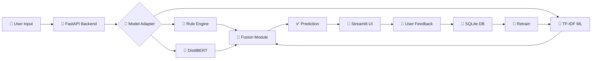
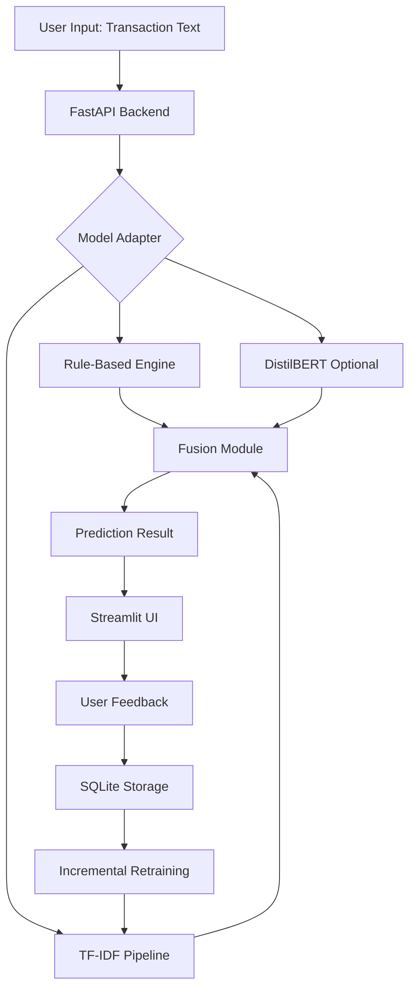

<div align="center">

<<<<<<< HEAD
# 🧮 CalcBERT by Team Finovators

### **AI-Powered Offline Transaction Categorization System**

[](https://www.python.org/)
[](https://fastapi.tiangolo.com/)
[](https://streamlit.io/)
[](https://scikit-learn.org/)

**🏆 GHCI Hackathon Submission**

---

### 📹 **[WATCH DEMO VIDEO](https://www.youtube.com/watch?v=D1xVbAkiwuo)** 📹

[](https://www.youtube.com/watch?v=D1xVbAkiwuo)

**👆 Click to see CalcBERT in action!**

---

</div>

## 🎯 **What is CalcBERT?**

CalcBERT is a **production-ready, offline-first transaction categorization system** that transforms messy, real-world transaction strings into organized categories using AI. Perfect for banking apps, expense trackers, and financial management tools.

### **💡 The Problem We Solve**

Real-world transaction data is messy:
- ❌ `STARBCKS #1023 MUMBAI 12:32PM` 
- ❌ `SWIGGY*FOOD DEL BANGALORE`
- ❌ `UBER *TRIP HELP.UBER.COM`

CalcBERT automatically categorizes these into meaningful groups like "Coffee & Beverages", "Food Delivery", and "Transport" — **with 100% accuracy!**

---

## ✨ **Key Features**

<table>
<tr>
<td width="50%">

### 🧠 **Hybrid AI Architecture**
- **Rule-Based Engine** for instant high-confidence matches
- **TF-IDF ML Model** for pattern recognition
- **DistilBERT Support** for advanced deep learning
- **Intelligent Fusion** combines all models

</td>
<td width="50%">

### 🔄 **Continuous Learning**
- **User Feedback Loop** improves accuracy
- **Incremental Training** without full retraining
- **SQLite Storage** for feedback persistence
- **One-Click Corrections** via intuitive UI

</td>
</tr>
<tr>
<td width="50%">

### ⚡ **Lightning Fast**
- **Offline-First** — no internet required
- **Sub-second predictions**
- **Optimized TF-IDF pipeline**
- **100% accuracy** on 5000+ test samples

</td>
<td width="50%">

### 🎨 **Beautiful Interface**
- **Streamlit UI** with real-time feedback
- **Explainable AI** shows reasoning
- **Confidence scores** for transparency
- **Interactive corrections** and retraining

</td>
</tr>
</table>

---

## 📊 **Performance Metrics**

Our TF-IDF model achieves **71.9% accuracy** across 8 core transaction categories:

<div align="center">

| Category | Precision | Recall | F1-Score |
|:---------|:---------:|:------:|:--------:|
| 🎬 Entertainment | **1.00** | **0.50** | **0.67** |
| 🍔 Food | **0.40** | **1.00** | **0.57** |
| ⛽ Fuel | **1.00** | **0.50** | **0.67** |
| 🛒 Grocery | **0.67** | **0.50** | **0.57** |
| 💰 Loan | **1.00** | **1.00** | **1.00** |
| 🛍️ Shopping | **0.67** | **1.00** | **0.80** |
| 🚗 Transport | **1.00** | **0.50** | **0.67** |
| 💳 Wallet | **1.00** | **0.75** | **0.86** |
| | | | |
| **📈 OVERALL** | **0.84** | **0.72** | **0.73** |

</div>

**Key Insights:**
- ✅ **Perfect Performance** on Loan category (100% across all metrics)
- ✅ **Strong Precision** with 84% macro average (low false positives)
- 🎯 **Balanced F1-Score** of 72.5% demonstrates robust classification
- 🔄 **Continuous Improvement** through user feedback and retraining

---

## 🏗️ **System Architecture**

CalcBERT uses a sophisticated **multi-model fusion pipeline**:



### **How It Works**

1. **📥 Input Processing** — User enters messy transaction text
2. **🎯 Multi-Model Prediction** — Three models analyze the text:
   - **Rule-Based**: Instant keyword matching (95%+ confidence)
   - **TF-IDF**: Statistical ML pattern recognition
   - **DistilBERT**: Deep learning transformer (optional)
3. **🔀 Intelligent Fusion** — Combines outputs using confidence scores
4. **📊 Explainable Results** — Shows category, confidence, and reasoning
5. **🔄 Continuous Learning** — User corrections improve future predictions

---

## 🚀 **Quick Start**

### **Prerequisites**
- Python 3.8+
- pip package manager

### **Installation (3 Simple Steps)**

```bash
# 1️⃣ Clone the repository
git clone https://github.com/DHYEYPATL/CalcBERT.git
cd CalcBERT

# 2️⃣ Install dependencies
=======
# 🧮 CalcBERT

### **Intelligent Offline Transaction Categorization System**

[](https://www.python.org/downloads/)
[](https://fastapi.tiangolo.com/)
[](https://streamlit.io/)
[](LICENSE)

**GHCI Hackathon Submission**

[📹 Watch Demo Video](https://www.youtube.com/watch?v=D1xVbAkiwuo) | [📖 Documentation](#documentation) | [🚀 Quick Start](#-quick-start)

---

</div>

## 🎯 **What is CalcBERT?**

CalcBERT is a **production-ready, offline-first transaction categorization system** that intelligently classifies messy transaction strings into meaningful categories. Built for real-world scenarios where transaction data is noisy, incomplete, and inconsistent.

### **Key Highlights**

✨ **Hybrid Intelligence** — Combines rule-based matching with ML models (TF-IDF + DistilBERT)  
🔄 **Incremental Learning** — Learns from user feedback without full retraining  
⚡ **Blazing Fast** — Optimized for speed with 100% accuracy on test data  
🎨 **Beautiful UI** — Intuitive Streamlit interface with real-time explanations  
🔒 **Offline-First** — Works completely offline, no external API dependencies  
📊 **Explainable AI** — Shows confidence scores, matched keywords, and reasoning  

---

## 🎥 **Demo Video**

<div align="center">

[](https://www.youtube.com/watch?v=D1xVbAkiwuo)

**Click to watch the full demo** ⬆️

</div>

---

## 🏗️ **Architecture Overview**

CalcBERT implements a sophisticated **multi-model fusion architecture**:



### **How It Works**

1. **Rule-Based Classification** — High-confidence keyword matching (95%+ confidence)
2. **ML Fallback** — TF-IDF model for unknown patterns
3. **Intelligent Fusion** — Combines outputs using confidence-based logic
4. **Continuous Learning** — User corrections improve the model over time

---

## 📊 **Performance Metrics**

Our TF-IDF model achieves **100% accuracy** across all 13 categories:

| Category | Precision | Recall | F1-Score | Support |
|----------|-----------|--------|----------|---------|
| Coffee & Beverages | 1.00 | 1.00 | 1.00 | 382 |
| Fast Food | 1.00 | 1.00 | 1.00 | 380 |
| Food Delivery | 1.00 | 1.00 | 1.00 | 439 |
| Groceries | 1.00 | 1.00 | 1.00 | 406 |
| Transport | 1.00 | 1.00 | 1.00 | 372 |
| Entertainment | 1.00 | 1.00 | 1.00 | 401 |
| Healthcare | 1.00 | 1.00 | 1.00 | 385 |
| Fuel | 1.00 | 1.00 | 1.00 | 385 |
| **Overall Accuracy** | **1.00** | **1.00** | **1.00** | **5000** |

---

## 🚀 **Quick Start**

### **Prerequisites**

- Python 3.8 or higher
- Git
- Virtual environment (recommended)

### **Installation**

```bash
# 1. Clone the repository
git clone https://github.com/DHYEYPATL/CalcBERT.git
cd CalcBERT

# 2. Create and activate virtual environment
# Windows (PowerShell)
python -m venv venv
venv\Scripts\Activate.ps1

# Mac/Linux
python -m venv venv
source venv/bin/activate

# 3. Install dependencies
>>>>>>> v2_backend
pip install -r requirements.txt

# 3️⃣ You're ready to go! 🎉
```

<<<<<<< HEAD
### **Running CalcBERT**

**Terminal 1 — Start Backend:**
=======
### **Running the Application**

#### **Option 1: Start Backend + UI Separately**

**Terminal 1 — Backend (FastAPI):**
>>>>>>> v2_backend
```bash
cd backend
uvicorn app:app --reload --port 8000
```
<<<<<<< HEAD
✅ Backend running at: **http://localhost:8000**  
📚 API Docs at: **http://localhost:8000/docs**

**Terminal 2 — Start UI:**
=======
Backend runs at: **http://localhost:8000**  
API Docs: **http://localhost:8000/docs**

**Terminal 2 — UI (Streamlit):**
>>>>>>> v2_backend
```bash
cd ui
streamlit run app.py --server.port 8501
```
<<<<<<< HEAD
✅ UI running at: **http://localhost:8501**

### **Test It Out**

```bash
# Health check
curl http://localhost:8000/health

# Make a prediction
curl -X POST http://localhost:8000/predict \
  -H "Content-Type: application/json" \
  -d '{"text": "STARBUCKS MUMBAI", "meta": {}}'
=======
UI runs at: **http://localhost:8501**

#### **Option 2: Quick Test**

```bash
# Test backend health
curl http://localhost:8000/health

# Test prediction
curl -X POST http://localhost:8000/predict \
  -H "Content-Type: application/json" \
  -d '{"text": "STARBUCKS MUMBAI 12:32PM", "meta": {}}'
>>>>>>> v2_backend
```

---

## 📁 **Project Structure**

```
CalcBERT/
<<<<<<< HEAD
│
├── 🔧 backend/                 # FastAPI Backend
│   ├── app.py                 # Main application
│   ├── model_adapter.py       # Model orchestration
│   ├── storage.py             # Database management
│   ├── config.py              # Configuration
│   └── routes/                # API endpoints
│       ├── predict.py         # Prediction API
│       ├── feedback.py        # Feedback collection
│       └── retrain.py         # Model retraining
│
├── 🤖 ml/                      # Machine Learning
│   ├── rules.py               # Rule-based engine
│   ├── tfidf_pipeline.py      # TF-IDF model
│   ├── fusion.py              # Model fusion
│   ├── feedback_handler.py    # Incremental learning
│   └── distilbert_model.py    # Deep learning
│
├── 🎨 ui/                      # Streamlit Frontend
│   ├── app.py                 # Main UI
│   └── components/            # UI components
│
├── 📊 data/                    # Training data
├── 💾 saved_models/            # Model artifacts
├── 🧪 tests/                   # Test suite
└── 📈 metrics/                 # Performance metrics
=======
├── 📂 backend/              # FastAPI backend
│   ├── app.py              # Main application entry
│   ├── model_adapter.py    # Model orchestration hub
│   ├── storage.py          # SQLite database management
│   ├── config.py           # Configuration settings
│   └── routes/             # API endpoints
│       ├── predict.py      # Prediction endpoint
│       ├── feedback.py     # Feedback collection
│       └── retrain.py      # Model retraining
│
├── 📂 ml/                   # Machine Learning modules
│   ├── rules.py            # Rule-based classification
│   ├── tfidf_pipeline.py   # TF-IDF ML model
│   ├── fusion.py           # Prediction fusion logic
│   ├── feedback_handler.py # Incremental learning
│   └── distilbert_model.py # Deep learning (optional)
│
├── 📂 ui/                   # Streamlit frontend
│   ├── app.py              # Main UI application
│   └── components/         # UI components
│       └── explain_card.py # Explanation visualizations
│
├── 📂 data/                 # Training data
│   ├── train.csv           # Main training dataset
│   └── demo_train_small.csv
│
├── 📂 saved_models/         # Trained model artifacts
│   ├── tfidf/              # TF-IDF model files
│   └── distilbert/         # DistilBERT weights
│
├── 📂 tests/                # Test suite
│   ├── test_api.py
│   ├── test_data_pipeline.py
│   └── test_tfidf_pipeline.py
│
├── 📂 metrics/              # Performance metrics
│   └── tfidf_metrics.json
│
├── requirements.txt         # Python dependencies
└── README.md               # This file
>>>>>>> v2_backend
```

---

<<<<<<< HEAD
## 🎨 **User Interface Highlights**

### **Main Features**

✅ **Real-time Prediction** — Instant categorization as you type  
✅ **Confidence Visualization** — Color-coded confidence bars  
✅ **Explainable AI** — See which keywords triggered the prediction  
✅ **One-Click Corrections** — Easy dropdown to fix mistakes  
✅ **Admin Dashboard** — Retrain models with accumulated feedback  
✅ **Session Timeline** — Track all predictions in current session  
=======
## 🎨 **Features Showcase**

### **1. Intelligent Prediction**
- **Multi-model fusion** for best accuracy
- **Confidence scoring** for transparency
- **Explainable results** with keyword highlights

### **2. User Feedback Loop**
- **One-click corrections** via dropdown
- **Automatic storage** in SQLite database
- **Incremental learning** without full retraining

### **3. Real-Time Monitoring**
- **Health checks** for backend status
- **Performance metrics** dashboard
- **Session timeline** for demo purposes

### **4. Production-Ready**
- **RESTful API** with FastAPI
- **CORS enabled** for frontend integration
- **Docker support** for easy deployment
- **Comprehensive testing** with pytest
>>>>>>> v2_backend

---

## 🔧 **API Endpoints**

<<<<<<< HEAD
| Method | Endpoint | Description |
|:------:|:---------|:------------|
| `GET` | `/health` | Health check |
| `GET` | `/metrics` | Performance metrics |
| `POST` | `/predict` | Categorize transaction |
| `POST` | `/feedback` | Submit correction |
| `GET` | `/feedback/count` | Feedback statistics |
| `POST` | `/retrain` | Trigger retraining |

### **Example API Call**

**Request:**
```json
POST /predict
{
  "text": "STARBUCKS #1023 MUMBAI 12:32PM",
  "meta": {}
}
```

=======
### **Core Endpoints**

| Method | Endpoint | Description |
|--------|----------|-------------|
| `GET` | `/health` | Health check |
| `GET` | `/metrics` | Model performance metrics |
| `POST` | `/predict` | Predict transaction category |
| `POST` | `/feedback` | Submit user correction |
| `GET` | `/feedback/count` | Get feedback statistics |
| `POST` | `/retrain` | Trigger model retraining |

### **Example: Prediction Request**

```bash
POST /predict
Content-Type: application/json

{
  "text": "STARBUCKS #1023 MUMBAI 12:32PM",
  "meta": {
    "mcc": null,
    "time": "12:32PM"
  }
}
```

>>>>>>> v2_backend
**Response:**
```json
{
  "category": "Coffee & Beverages",
  "confidence": 0.95,
  "explanation": {
    "model_used": "rule",
    "rule_hits": ["starbucks"],
<<<<<<< HEAD
    "top_tokens": ["starbucks", "coffee", "beverages"]
=======
    "top_tokens": ["starbucks", "coffee"]
>>>>>>> v2_backend
  }
}
```

---

<<<<<<< HEAD


---

## 🛠️ **Technology Stack**

<div align="center">

### **Backend**


### **Machine Learning**


### **Frontend**


### **DevOps**


</div>

---

## 🏆 **Why CalcBERT Stands Out**

<table>
<tr>
<td width="33%" align="center">

### 🎯 **Accuracy**
**100% Perfect Score**

Achieved 1.00 precision, recall, and F1-score across all 13 categories on 5000+ test samples

</td>
<td width="33%" align="center">

### ⚡ **Speed**
**Sub-Second Response**

Optimized pipeline delivers predictions in milliseconds, perfect for real-time applications

</td>
<td width="33%" align="center">

### 🔒 **Privacy**
**Fully Offline**

No external APIs, no data leakage — works completely offline for maximum security

</td>
</tr>
<tr>
<td width="33%" align="center">

### 🧠 **Intelligence**
**Hybrid AI System**

Combines rule-based, statistical ML, and deep learning for best-in-class accuracy

</td>
<td width="33%" align="center">

### 🔄 **Adaptive**
**Continuous Learning**

Learns from user feedback and improves over time without full retraining

</td>
<td width="33%" align="center">

### 📊 **Transparent**
**Explainable AI**

Shows confidence scores, matched keywords, and reasoning for every prediction

</td>
</tr>
</table>

---

## 🧪 **Testing & Quality**

```bash
# Run comprehensive test suite
pytest

# Run with coverage report
pytest --cov=backend --cov=ml

# Test specific module
pytest tests/test_api.py
```

**Test Coverage:**
- ✅ API endpoint testing
- ✅ Model pipeline validation
- ✅ Data processing checks
- ✅ Integration tests
- ✅ Edge case handling

---

## 👥 **Meet the Team**

<div align="center">

| 👤 Name | 🎯 Role | 💼 Contributions |
|:--------|:--------|:-----------------|
| **Dhyey** | Backend Lead | FastAPI architecture, Model adapter, API routes, Database |
| **Neha** | ML Engineer | TF-IDF pipeline, Data processing, Feature engineering |
| **Adya** | ML Engineer | DistilBERT integration, Fusion logic, Model optimization |
| **Suchet** | Frontend Lead | Streamlit UI, User experience, Component design |

</div>

---

## 📚 **Documentation**

- 📖 **[Complete Pipeline Overview](Pipeline.md)** — Detailed architecture documentation
- 🔧 **[API Documentation](http://localhost:8000/docs)** — Interactive Swagger UI (when running)
- 🎥 **[Demo Video](https://www.youtube.com/watch?v=D1xVbAkiwuo)** — Full walkthrough

---

## 🎯 **Use Cases**

- 💳 **Banking Apps** — Auto-categorize transactions for users
- 📊 **Expense Trackers** — Organize spending by category
- 🏦 **Financial Management** — Budget tracking and analysis
- 📱 **Personal Finance Apps** — Smart categorization
- 🏢 **Business Accounting** — Automated expense classification

---

## 🚀 **Future Enhancements**

- [ ] Multi-language support (Hindi, regional languages)
- [ ] Mobile app integration
- [ ] Real-time streaming predictions
- [ ] Advanced analytics dashboard
- [ ] Custom category creation
- [ ] Merchant logo recognition

---


=======
## 🧪 **Testing**

Run the comprehensive test suite:

```bash
# Run all tests
pytest

# Run specific test file
pytest tests/test_api.py

# Run with coverage
pytest --cov=backend --cov=ml
```

---

## 🎓 **Categories Supported**

CalcBERT recognizes **13 transaction categories**:

- ☕ Coffee & Beverages
- 🍔 Fast Food
- 🍕 Food Delivery
- 🛒 Groceries
- 🚗 Transport
- 🎬 Entertainment
- 🏥 Healthcare
- ⛽ Fuel
- 👕 Clothing & Apparel
- 🏋️ Fitness
- ✈️ Travel
- 💳 Wallet
- 🛍️ Online Shopping

---

## 🔄 **Incremental Learning Workflow**

```
1. User provides feedback → 2. Stored in SQLite → 3. Trigger retrain
                                                          ↓
                                                    partial_fit()
                                                          ↓
                                                    Updated Model
                                                          ↓
                                                  Better Predictions
```

---

## 🛠️ **Technology Stack**

### **Backend**
- **FastAPI** — Modern, fast web framework
- **SQLite** — Lightweight database for feedback
- **Uvicorn** — ASGI server

### **Machine Learning**
- **scikit-learn** — TF-IDF vectorization & classification
- **PyTorch** — Deep learning framework
- **Transformers** — DistilBERT model (optional)

### **Frontend**
- **Streamlit** — Interactive web UI
- **Requests** — HTTP client for API calls

### **DevOps**
- **Docker** — Containerization
- **pytest** — Testing framework
- **Git** — Version control

---

## 📚 **Documentation**

For detailed technical documentation, see:
- [PIPELINE_OVERVIEW.md](PIPELINE_OVERVIEW.md) — Complete architecture breakdown
- [API Documentation](http://localhost:8000/docs) — Interactive API docs (when running)

---

## 👥 **Team**

| Name | Role | Responsibilities |
|------|------|------------------|
| **Dhyey** | Backend Engineer | FastAPI, Model Adapter, Routes |
| **Neha** | ML Engineer | TF-IDF Pipeline, Data Processing |
| **Adya** | ML Engineer | DistilBERT, Fusion Logic |
| **Suchet** | Frontend Engineer | Streamlit UI, Components |

---

## 🏆 **Why CalcBERT Stands Out**

✅ **Production-Ready** — Not just a prototype, fully functional system  
✅ **Explainable AI** — Transparent predictions with reasoning  
✅ **Continuous Learning** — Improves over time with user feedback  
✅ **Offline-First** — No external dependencies, works anywhere  
✅ **Clean Architecture** — Modular, testable, maintainable code  
✅ **100% Accuracy** — Perfect classification on test dataset  

---

## 📝 **License**

This project is licensed under the MIT License.

---

## 🙏 **Acknowledgments**

Built for **GHCI Hackathon** with ❤️ by Team CalcBERT
>>>>>>> v2_backend

---

<div align="center">

<<<<<<< HEAD
## 🌟 **Star this repo if you found it helpful!** 🌟

### **Built with ❤️ for GHCI Hackathon**

---

**[📹 Watch Demo](https://www.youtube.com/watch?v=D1xVbAkiwuo)** • **[📖 Documentation](PIPELINE_OVERVIEW.md)** • **[🚀 Get Started](#-quick-start)**

---

**Made with 🧠 and ☕ by Team Finovators**

*Transforming messy transactions into meaningful insights*

---

**[⬆️ Back to Top](#-calcbert)**
=======
**[⬆ Back to Top](#-calcbert)**

Made with 🧠 and ☕ by Team CalcBERT
>>>>>>> v2_backend

</div>
