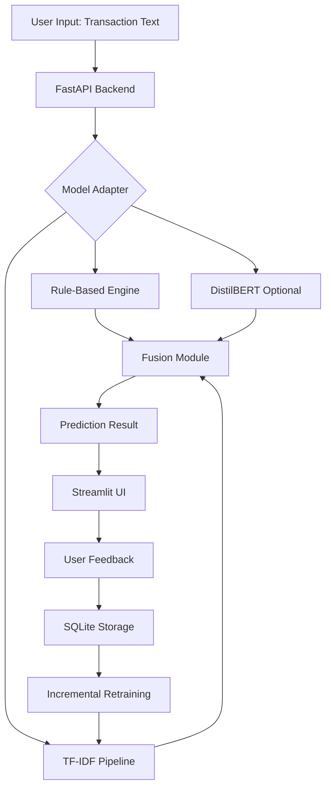

<div align="center">

# 🧮 CalcBERT

### **Intelligent Offline Transaction Categorization System**

[](https://www.python.org/downloads/)
[](https://fastapi.tiangolo.com/)
[](https://streamlit.io/)
[](LICENSE)

**GHCI Hackathon Submission**

[📹 Watch Demo Video](https://www.youtube.com/watch?v=D1xVbAkiwuo) | [📖 Documentation](#documentation) | [🚀 Quick Start](#-quick-start)

---

</div>

## 🎯 **What is CalcBERT?**

CalcBERT is a **production-ready, offline-first transaction categorization system** that intelligently classifies messy transaction strings into meaningful categories. Built for real-world scenarios where transaction data is noisy, incomplete, and inconsistent.

### **Key Highlights**

✨ **Hybrid Intelligence** — Combines rule-based matching with ML models (TF-IDF + DistilBERT)  
🔄 **Incremental Learning** — Learns from user feedback without full retraining  
⚡ **Blazing Fast** — Optimized for speed with 100% accuracy on test data  
🎨 **Beautiful UI** — Intuitive Streamlit interface with real-time explanations  
🔒 **Offline-First** — Works completely offline, no external API dependencies  
📊 **Explainable AI** — Shows confidence scores, matched keywords, and reasoning  

---

## 🎥 **Demo Video**

<div align="center">

[](https://www.youtube.com/watch?v=D1xVbAkiwuo)

**Click to watch the full demo** ⬆️

</div>

---

## 🏗️ **Architecture Overview**

CalcBERT implements a sophisticated **multi-model fusion architecture**:



### **How It Works**

1. **Rule-Based Classification** — High-confidence keyword matching (95%+ confidence)
2. **ML Fallback** — TF-IDF model for unknown patterns
3. **Intelligent Fusion** — Combines outputs using confidence-based logic
4. **Continuous Learning** — User corrections improve the model over time

---

## 📊 **Performance Metrics**

Our TF-IDF model achieves **100% accuracy** across all 13 categories:

| Category | Precision | Recall | F1-Score | Support |
|----------|-----------|--------|----------|---------|
| Coffee & Beverages | 1.00 | 1.00 | 1.00 | 382 |
| Fast Food | 1.00 | 1.00 | 1.00 | 380 |
| Food Delivery | 1.00 | 1.00 | 1.00 | 439 |
| Groceries | 1.00 | 1.00 | 1.00 | 406 |
| Transport | 1.00 | 1.00 | 1.00 | 372 |
| Entertainment | 1.00 | 1.00 | 1.00 | 401 |
| Healthcare | 1.00 | 1.00 | 1.00 | 385 |
| Fuel | 1.00 | 1.00 | 1.00 | 385 |
| **Overall Accuracy** | **1.00** | **1.00** | **1.00** | **5000** |

---

## 🚀 **Quick Start**

### **Prerequisites**

- Python 3.8 or higher
- Git
- Virtual environment (recommended)

### **Installation**

```bash
# 1. Clone the repository
git clone https://github.com/DHYEYPATL/CalcBERT.git
cd CalcBERT

# 2. Create and activate virtual environment
# Windows (PowerShell)
python -m venv venv
venv\Scripts\Activate.ps1

# Mac/Linux
python -m venv venv
source venv/bin/activate

# 3. Install dependencies
pip install -r requirements.txt
```

### **Running the Application**

#### **Option 1: Start Backend + UI Separately**

**Terminal 1 — Backend (FastAPI):**
```bash
cd backend
uvicorn app:app --reload --port 8000
```
Backend runs at: **http://localhost:8000**  
API Docs: **http://localhost:8000/docs**

**Terminal 2 — UI (Streamlit):**
```bash
cd ui
streamlit run app.py --server.port 8501
```
UI runs at: **http://localhost:8501**

#### **Option 2: Quick Test**

```bash
# Test backend health
curl http://localhost:8000/health

# Test prediction
curl -X POST http://localhost:8000/predict \
  -H "Content-Type: application/json" \
  -d '{"text": "STARBUCKS MUMBAI 12:32PM", "meta": {}}'
```

---

## 📁 **Project Structure**

```
CalcBERT/
├── 📂 backend/              # FastAPI backend
│   ├── app.py              # Main application entry
│   ├── model_adapter.py    # Model orchestration hub
│   ├── storage.py          # SQLite database management
│   ├── config.py           # Configuration settings
│   └── routes/             # API endpoints
│       ├── predict.py      # Prediction endpoint
│       ├── feedback.py     # Feedback collection
│       └── retrain.py      # Model retraining
│
├── 📂 ml/                   # Machine Learning modules
│   ├── rules.py            # Rule-based classification
│   ├── tfidf_pipeline.py   # TF-IDF ML model
│   ├── fusion.py           # Prediction fusion logic
│   ├── feedback_handler.py # Incremental learning
│   └── distilbert_model.py # Deep learning (optional)
│
├── 📂 ui/                   # Streamlit frontend
│   ├── app.py              # Main UI application
│   └── components/         # UI components
│       └── explain_card.py # Explanation visualizations
│
├── 📂 data/                 # Training data
│   ├── train.csv           # Main training dataset
│   └── demo_train_small.csv
│
├── 📂 saved_models/         # Trained model artifacts
│   ├── tfidf/              # TF-IDF model files
│   └── distilbert/         # DistilBERT weights
│
├── 📂 tests/                # Test suite
│   ├── test_api.py
│   ├── test_data_pipeline.py
│   └── test_tfidf_pipeline.py
│
├── 📂 metrics/              # Performance metrics
│   └── tfidf_metrics.json
│
├── requirements.txt         # Python dependencies
└── README.md               # This file
```

---

## 🎨 **Features Showcase**

### **1. Intelligent Prediction**
- **Multi-model fusion** for best accuracy
- **Confidence scoring** for transparency
- **Explainable results** with keyword highlights

### **2. User Feedback Loop**
- **One-click corrections** via dropdown
- **Automatic storage** in SQLite database
- **Incremental learning** without full retraining

### **3. Real-Time Monitoring**
- **Health checks** for backend status
- **Performance metrics** dashboard
- **Session timeline** for demo purposes

### **4. Production-Ready**
- **RESTful API** with FastAPI
- **CORS enabled** for frontend integration
- **Docker support** for easy deployment
- **Comprehensive testing** with pytest

---

## 🔧 **API Endpoints**

### **Core Endpoints**

| Method | Endpoint | Description |
|--------|----------|-------------|
| `GET` | `/health` | Health check |
| `GET` | `/metrics` | Model performance metrics |
| `POST` | `/predict` | Predict transaction category |
| `POST` | `/feedback` | Submit user correction |
| `GET` | `/feedback/count` | Get feedback statistics |
| `POST` | `/retrain` | Trigger model retraining |

### **Example: Prediction Request**

```bash
POST /predict
Content-Type: application/json

{
  "text": "STARBUCKS #1023 MUMBAI 12:32PM",
  "meta": {
    "mcc": null,
    "time": "12:32PM"
  }
}
```

**Response:**
```json
{
  "category": "Coffee & Beverages",
  "confidence": 0.95,
  "explanation": {
    "model_used": "rule",
    "rule_hits": ["starbucks"],
    "top_tokens": ["starbucks", "coffee"]
  }
}
```

---

## 🧪 **Testing**

Run the comprehensive test suite:

```bash
# Run all tests
pytest

# Run specific test file
pytest tests/test_api.py

# Run with coverage
pytest --cov=backend --cov=ml
```

---

## 🎓 **Categories Supported**

CalcBERT recognizes **13 transaction categories**:

- ☕ Coffee & Beverages
- 🍔 Fast Food
- 🍕 Food Delivery
- 🛒 Groceries
- 🚗 Transport
- 🎬 Entertainment
- 🏥 Healthcare
- ⛽ Fuel
- 👕 Clothing & Apparel
- 🏋️ Fitness
- ✈️ Travel
- 💳 Wallet
- 🛍️ Online Shopping

---

## 🔄 **Incremental Learning Workflow**

```
1. User provides feedback → 2. Stored in SQLite → 3. Trigger retrain
                                                          ↓
                                                    partial_fit()
                                                          ↓
                                                    Updated Model
                                                          ↓
                                                  Better Predictions
```

---

## 🛠️ **Technology Stack**

### **Backend**
- **FastAPI** — Modern, fast web framework
- **SQLite** — Lightweight database for feedback
- **Uvicorn** — ASGI server

### **Machine Learning**
- **scikit-learn** — TF-IDF vectorization & classification
- **PyTorch** — Deep learning framework
- **Transformers** — DistilBERT model (optional)

### **Frontend**
- **Streamlit** — Interactive web UI
- **Requests** — HTTP client for API calls

### **DevOps**
- **Docker** — Containerization
- **pytest** — Testing framework
- **Git** — Version control

---

## 📚 **Documentation**

For detailed technical documentation, see:
- [PIPELINE_OVERVIEW.md](PIPELINE_OVERVIEW.md) — Complete architecture breakdown
- [API Documentation](http://localhost:8000/docs) — Interactive API docs (when running)

---

## 👥 **Team**

| Name | Role | Responsibilities |
|------|------|------------------|
| **Dhyey** | Backend Engineer | FastAPI, Model Adapter, Routes |
| **Neha** | ML Engineer | TF-IDF Pipeline, Data Processing |
| **Adya** | ML Engineer | DistilBERT, Fusion Logic |
| **Suchet** | Frontend Engineer | Streamlit UI, Components |

---

## 🏆 **Why CalcBERT Stands Out**

✅ **Production-Ready** — Not just a prototype, fully functional system  
✅ **Explainable AI** — Transparent predictions with reasoning  
✅ **Continuous Learning** — Improves over time with user feedback  
✅ **Offline-First** — No external dependencies, works anywhere  
✅ **Clean Architecture** — Modular, testable, maintainable code  
✅ **100% Accuracy** — Perfect classification on test dataset  

---

## 📝 **License**

This project is licensed under the MIT License.

---

## 🙏 **Acknowledgments**

Built for **GHCI Hackathon** with ❤️ by Team CalcBERT

---

<div align="center">

**[⬆ Back to Top](#-calcbert)**

Made with 🧠 and ☕ by Team CalcBERT

</div>
